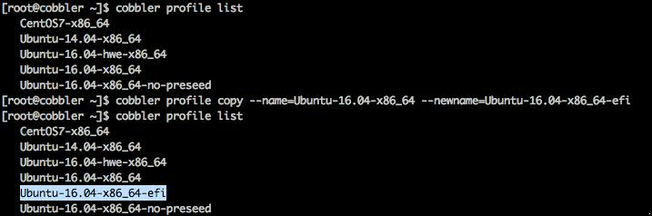
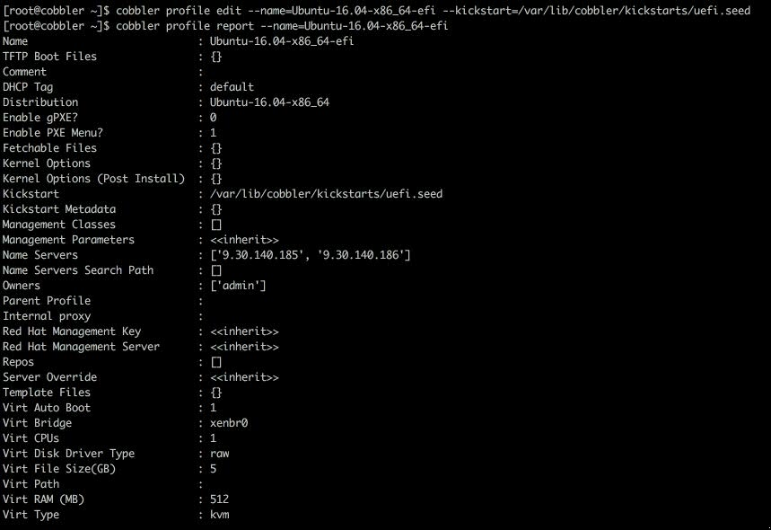

# Creating an Ubuntu 16.04 uefi profile in cobbler

Preface: This guide does not cover basic cobbler installation or configuration
1.	To start I made a copy of my normal Ubuntu 16.04 install

`cobbler profile copy --name=Ubuntu-16.04-x86_64 --newname=Ubuntu-16.04-x86_64-efi`

2. Once we have a new profile to work with we can create a copy of the seed file to work with.

`cp /var/lib/cobbler/kickstarts/sample.seed /var/lib/cobbler/kickstarts/uefi.seed`

  Then set it as the seed file for the profile

`cobbler profile edit --name=Ubuntu-16.04-x86_64-efi kickstart=/var/lib/cobbler/kickstarts/uefi.seed`

